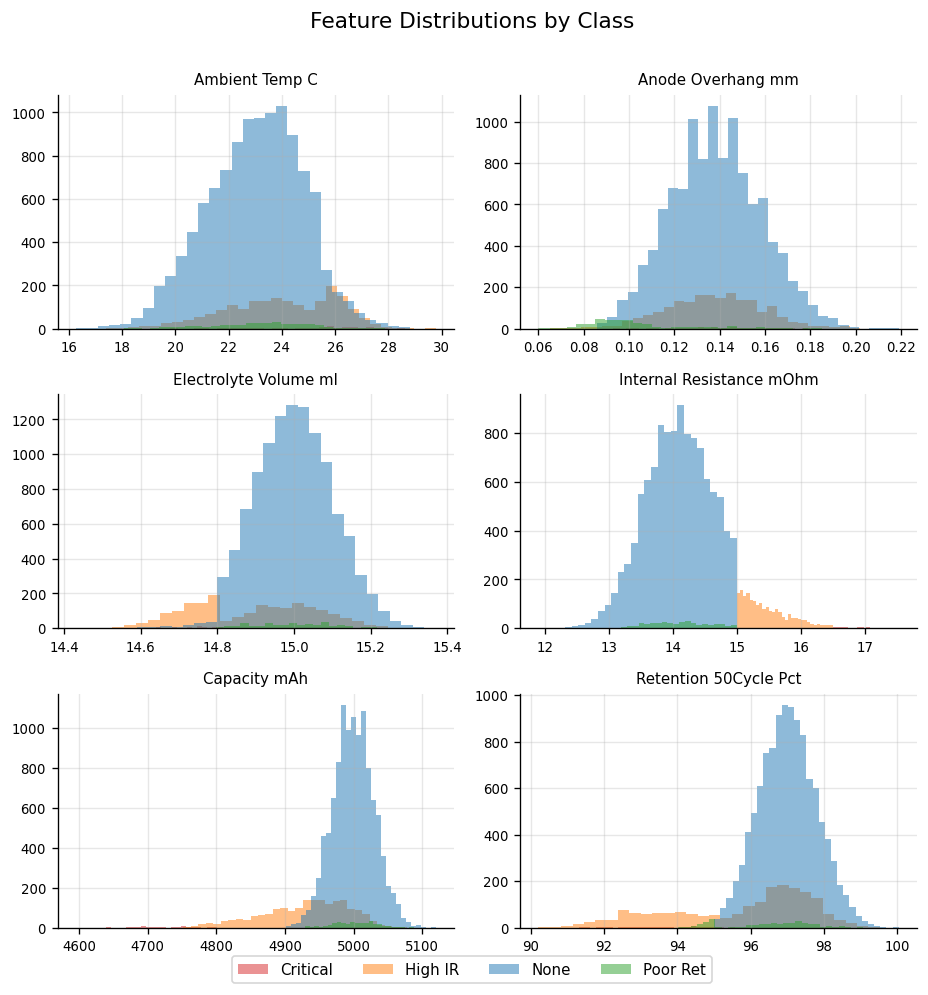
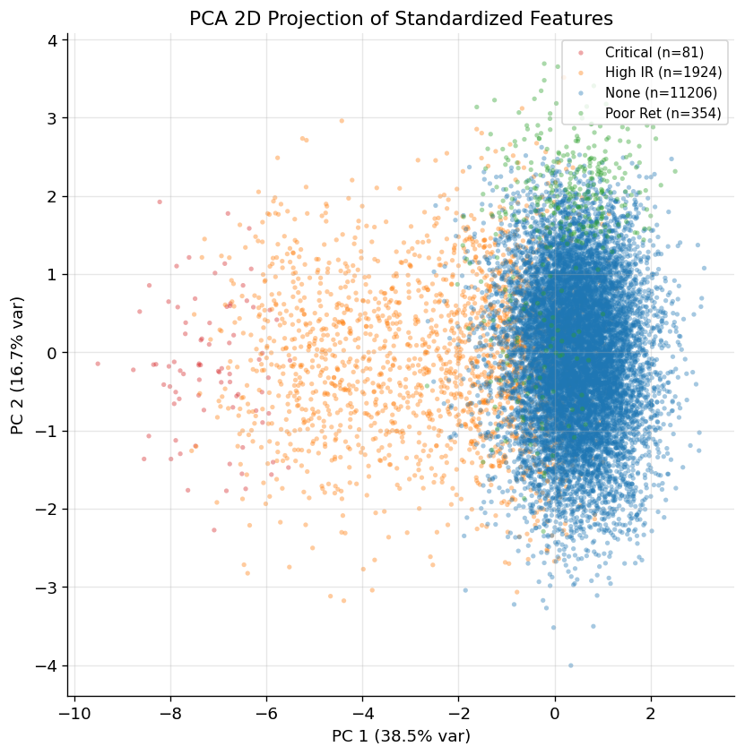
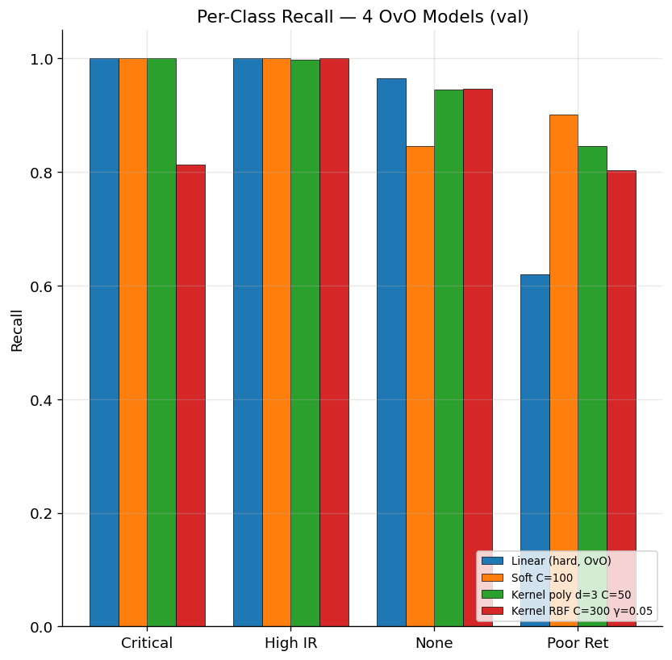
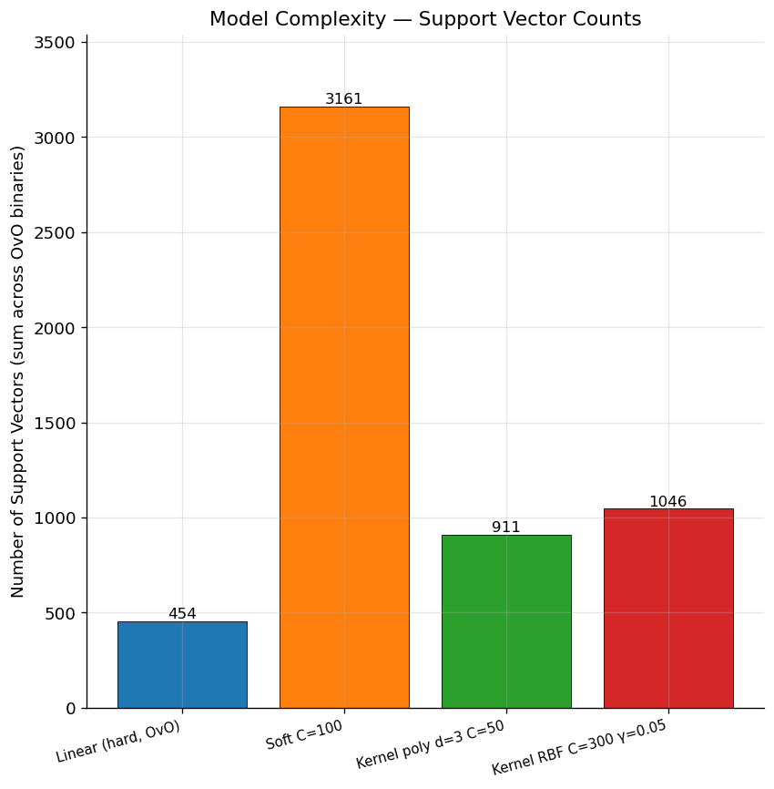

# STAI 중간 프로젝트 최종 보고서

> **EV 배터리 셀 결함 분류기 — Support Vector Machine (SVM) 자체 구현**
>
> 김재경 (jkkim-irim) · 2026-04-29
>
> Repository: <https://github.com/jkkim-irim/STAI>

---

## 📋 목차

0. [한 페이지 요약](#0-한-페이지-요약)
1. [데이터 이해](#1-데이터-이해)
2. [알고리즘 구현](#2-알고리즘-구현)
3. [학습 절차](#3-학습-절차)
4. [결과](#4-결과)
5. [심층 분석](#5-심층-분석)
6. [결론 및 제출 모델](#6-결론-및-제출-모델)
7. [부록](#7-부록)

---

## 0. 한 페이지 요약

### 📌 문제

EV 배터리 셀의 6 가지 측정값으로부터 **결함 유형 4 가지** 중 하나를 분류한다.

### 📌 접근

| 단계 | 내용 |
| --- | --- |
| ① 알고리즘 구현 | SVM 3 변형 (선형/소프트/비선형 커널) — `sklearn.svm` 등 SVM 라이브러리 미사용, 일반 QP solver `cvxopt` 만 활용 |
| ② 다중 클래스 처리 | One-vs-Rest (OvR), One-vs-One (OvO) 두 전략 모두 구현 + 비교 |
| ③ 하이퍼파라미터 선정 | 5-fold 교차검증 (CV) sweep |
| ④ 4 변형 × 2 전략 = 8 모델 학습 후 검증 | val 정확도 / macro F1 / 클래스별 metric 종합 비교 |

### 📌 결과 (val set, n=2,713)

| 변형 | 다중 클래스 | val accuracy | val macro F1 | 비고 |
| --- | --- | --- | --- | --- |
| 선형 hard-margin | OvO | **0.9617** | 0.860 | **🏆 전체 1 위** |
| 비선형 (poly d=3) | OvO | 0.9506 | **0.863** | mF1 1 위 |
| 비선형 (RBF) | OvO | 0.9495 | 0.833 | |
| 선형 분리불가능 | OvO | 0.8699 | 0.794 | |

### 📌 제출 모델 (룰 1: 선형/소프트/비선형 SVM 모두 구현)

```
선형 SVM            : models/linear_hard_ovo.pkl       (val_acc=0.9617)
선형 분리불가능 SVM : models/soft_C100_ovo.pkl
비선형 SVM (poly)   : models/kernel_poly_d3_C50_ovo.pkl
비선형 SVM (RBF)    : models/kernel_rbf_C300_g005_ovo.pkl
```

### 📌 사용법 (`predict.py` 한 줄)

```bash
python predict.py --model models/linear_hard_ovo.pkl \
    --in 입력CSV.csv --out 예측결과.csv
```

→ 입력 CSV 의 6 피처 컬럼만 정확히 있으면 자동 동작. 결과 CSV 에 `Defect_Type_Pred` 컬럼 추가.

---

## 1. 데이터 이해

### 1.1 데이터셋 스펙

| 항목 | 값 |
| --- | --- |
| 출처 | 과제 제공 `datasets/ev_battery_qc_train.csv` |
| 샘플 수 | **13,565** 행 |
| 입력 피처 | 6 개 (아래 표) |
| 타깃 (예측 대상) | `Defect_Type` — 4 클래스 |

#### 입력 피처 6 개 (수치형)

| # | 컬럼명 | 의미 |
| --- | --- | --- |
| 1 | `Ambient_Temp_C` | 측정 시 주변 온도 (섭씨) |
| 2 | `Anode_Overhang_mm` | 음극이 양극보다 튀어나온 거리 (밀리미터) |
| 3 | `Electrolyte_Volume_ml` | 전해액 주입량 (밀리리터) |
| 4 | `Internal_Resistance_mOhm` | 내부 저항 (밀리옴) |
| 5 | `Capacity_mAh` | 초기 용량 (밀리암페어시) |
| 6 | `Retention_50Cycle_Pct` | 50 사이클 후 용량 유지율 (%) |

#### 타깃 클래스 4 가지 (전문 용어 풀이)

| 클래스 (영문) | 보고서 표기 | 의미 (한국어 풀이) |
| --- | --- | --- |
| `None` | None / 정상 | 결함 없음 — 정상 셀 |
| `High Internal Resistance` | **High IR** | 내부 저항이 높아 효율 낮음 |
| `Poor Retention` | Poor Retention | 사이클 반복 시 용량 빠르게 감소 |
| `Critical Resistance` | Critical | 매우 심각한 저항 결함, 폐기 대상 |

> 본 보고서에서는 그림에 공간이 좁아 **"Critical / High IR / None / Poor Ret"** 약어를 사용한다.

### 1.2 클래스 분포 — 극심한 불균형


**그림 1.** 4 클래스의 표본 수 분포. 정상 셀(None)이 82.6% 로 압도적, 심각 결함(Critical)은 0.6% 에 불과. 이러한 **불균형 (class imbalance)** 때문에 단순 정확도(accuracy)만 보면 "전부 None 으로 찍기"만 해도 82% 가 나온다 → **macro F1 score** 같은 클래스 동등 가중 지표가 더 적합한 평가 척도다.

### 1.3 피처별 분포



**그림 2.** 6 피처 × 4 클래스 히스토그램. **각 색깔이 한 클래스의 분포**:
- 빨강 = Critical
- 주황 = High IR
- 파랑 = None
- 초록 = Poor Retention

`Internal_Resistance_mOhm` 에서 빨강(Critical) 분포가 가장 오른쪽 — 저항 결함이라 당연히 저항값이 높음. `Retention_50Cycle_Pct` 에서 초록(Poor Retention) 분포가 가장 왼쪽 — 정의상 retention 낮음. **피처 ↔ 클래스 의미가 일관됨을 데이터로 확인**.

### 1.4 PCA 2D 투영



**그림 3.** 6 차원 표준화 데이터를 **PCA (Principal Component Analysis = 주성분 분석)** 로 2 차원으로 축소한 산점도.

- **x축 PC 1**: 가장 분산이 큰 방향 (= 클래스 구분에 가장 도움 되는 축). 변동의 32.9% 차지
- **y축 PC 2**: 다음으로 분산 큰 방향. 17.7%
- 각 점 = 한 셀
- 색깔 = 진짜 클래스

**관찰**:
- 빨강 (Critical) 은 좌상단에 명확히 분리됨 → **가장 쉬운 클래스**
- 파랑 (None) 과 주황 (High IR) 가 중앙에서 **일부 겹침** → 어려운 영역
- 초록 (Poor Retention) 은 일부 파랑과 섞임

→ **선형 분리는 부분적으로 가능**, 일부 영역에서 비선형 결정경계가 도움될 수 있음을 시사.

---

## 2. 알고리즘 구현

### 2.1 SVM 의 핵심 — "마진 최대화"

강의자료 11.4 의 핵심 아이디어:

```
두 클래스 사이에 가장 넓은 "안전 영역(margin)"을 만드는
직선/평면을 찾는다.
```

수식 (강의 식 11.23):
```
d(x) = w₁x₁ + w₂x₂ + ... + w₆x₆ + b = wᵀx + b
```

이 식이 0 인 점들의 집합 = **결정 초평면 (decision hyperplane)**. 6 차원 공간에서 5 차원 평면.

### 2.2 3 변형 구현 (룰 1 — "선형 SVM, 선형 분리불가능 SVM, 비선형 SVM 구현")

| 변형 | 한국어 | 가정 | 코드 클래스 |
| --- | --- | --- | --- |
| **Linear hard-margin** | 선형 SVM | 데이터가 직선/평면으로 **완벽히** 분리됨 | [`LinearHardMarginSVM`](../src/svm.py#L257) |
| **Soft margin** | 선형 분리불가능 SVM | 직선/평면 + 일부 위반 허용 (slack 변수 ξ) | [`SoftMarginSVM`](../src/svm.py#L270) |
| **Kernel SVM** | 비선형 SVM | 곡면 결정경계 (kernel trick) | [`KernelSVM`](../src/svm.py#L277) |

#### 강의 식 ↔ 우리 코드 매핑

| 강의 식 / 알고리즘 | 우리 코드 |
| --- | --- |
| 결정 함수 식 11.23 (`d(x) = wᵀx + b`) | [`_BaseSVM.decision_function`](../src/svm.py#L155) |
| Hard-margin 듀얼 (식 11-5) | `LinearHardMarginSVM` (C=1e6 으로 사실상 hard) |
| Soft-margin 듀얼 (식 11-9) — `0 ≤ α ≤ C` 박스 제약 | `SoftMarginSVM` |
| 커널 SVM 듀얼 (식 11-10) — `K(x_i, x_j)` | `KernelSVM` |
| 다항식 커널 (식 11.6, `K = (γ x·z + 1)^p`) | `kernel='poly'` |
| RBF 커널 (식 11.7, `K = exp(-‖x−z‖²/(2σ²))`) | `kernel='rbf'` |
| KKT 조건 (식 11.27~11.30) | cvxopt QP solver 가 자동 만족 |
| Bias `b` 계산 (식 11.39) | margin support vector 들에서 평균 |

### 2.3 다중 클래스 전략 (강의자료 11.4.3 의 두 기법)

SVM 자체는 **2 클래스 분류기**. 4 클래스를 다루려면 binary 분류기를 여러 개 묶어야 함.

| 전략 | 강의자료 명칭 | 설명 | binary 분류기 수 |
| --- | --- | --- | --- |
| **OvR** (One-vs-Rest) | **1대c-1 기법** | 한 클래스 vs 나머지 모두, c 개 | 4 |
| **OvO** (One-vs-One) | **1대1 기법** | 두 클래스끼리 모든 쌍, c(c-1)/2 개 | 6 |

코드:
- [`MultiClassOvR`](../src/svm.py#L307) — OvR 구현
- [`MultiClassOvO`](../src/svm.py#L432) — OvO 구현

### 2.4 최적화 알고리즘 — `cvxopt` QP Solver (룰 4 — 외부 최적화 라이브러리 허용)

SVM 의 듀얼 문제는 **2 차 계획법 (Quadratic Programming, QP)** 형태:

```
min  ½ αᵀ P α − 1ᵀ α
s.t. Σ α_i y_i = 0
     0 ≤ α_i ≤ C  (soft margin)
```

`cvxopt.solvers.qp` 는 일반 QP solver — **SVM 전용 라이브러리 아님** (룰 3 위배 X). 룰 4 가 명시적으로 허용한 외부 최적화 라이브러리.

`α` 가 풀리면:
- `w = Σ α_i y_i x_i` (식 11.27)
- `b` 는 마진 support vector 평균 (식 11.39)
- 비선형 커널의 경우 `decision_function(x) = Σ α_i y_i K(x_i, x) + b` (식 11.44)

---

## 3. 학습 절차

### 3.1 전처리

| 단계 | 처리 | 이유 |
| --- | --- | --- |
| `Defect_Type` 의 NaN | `"None"` 으로 채움 | NaN 자체가 정상 셀을 의미 |
| 라벨 인코딩 | 클래스 → 정수 0~3 | SVM 내부 계산용 |
| 표준화 (StandardScaler) | 평균 0, 표준편차 1 | 피처 스케일이 매우 다름 (`Capacity` 5000 vs `Anode_Overhang` 0.14) → 정규화 필수 |
| Stratified 80/20 split | seed=42 | train (10,852) / val (2,713). 클래스 비율 보존 |

### 3.2 하이퍼파라미터 선정 — 2 단계 sweep

**1 차 sweep** (`scripts/sweep.py`): 33 개 config 를 단일 train/val 로 빠르게 비교 → 베스트 영역 식별.

**2 차 CV sweep** (`scripts/sweep_cv.py`): 1 차 베스트 영역의 finer grid (34 config) 를 **5-fold 교차검증 (Cross-Validation)** 으로 안정성 검증.

> **5-fold CV** = 데이터를 5 등분, 4 부분으로 학습 / 1 부분으로 평가 — 5 번 반복 평균. 단일 split 의 운에 의존하지 않음.

#### CV sweep 베스트 (변형별)

| 변형 | 베스트 config | CV macro-F1 |
| --- | --- | --- |
| 선형 hard-margin | `class_weight=none` | 0.7815 ± 0.0139 |
| 선형 soft margin | `C=100, balanced` | 0.7412 ± 0.0178 |
| 비선형 poly | **`degree=3, C=50, balanced`** | 0.8433 ± 0.0188 |
| 비선형 RBF | `C=300, γ=0.05, balanced` | 0.8403 ± 0.0203 |

자세한 sweep 결과는 [`03_sweep_2026-04-29.md`](03_sweep_2026-04-29.md) 참조.

### 3.3 최종 학습 명령 (8 모델)

각 변형 × {OvR, OvO} 조합으로 8 회 학습:

```bash
# 선형 SVM (hard-margin)
python train.py --variant linear --max-train-samples 8000 \
    --class-weight none --seed 42 --multiclass {ovr|ovo} \
    --out models/linear_hard{,_ovo}.pkl

# 선형 분리불가능 SVM (soft margin)
python train.py --variant soft --C 100 --class-weight balanced \
    --seed 42 --multiclass {ovr|ovo} \
    --out models/soft_C100{,_ovo}.pkl

# 비선형 SVM (다항식)
python train.py --variant kernel --kernel poly --C 50 --degree 3 \
    --coef0 1.0 --gamma scale --class-weight balanced --seed 42 \
    --multiclass {ovr|ovo} \
    --out models/kernel_poly_d3_C50{,_ovo}.pkl

# 비선형 SVM (RBF)
python train.py --variant kernel --kernel rbf --C 300 --gamma 0.05 \
    --class-weight balanced --seed 42 --multiclass {ovr|ovo} \
    --out models/kernel_rbf_C300_g005{,_ovo}.pkl
```

#### 하이퍼파라미터 의미

| 파라미터 | 의미 | 우리 값 |
| --- | --- | --- |
| `C` | 마진 위반 페널티 강도. 클수록 엄격 | 1e6 (linear), 100 (soft), 50 (poly), 300 (rbf) |
| `γ` (gamma) | RBF / poly 의 영향력 반경 | `'scale'` = 1/(d × Var) (auto), 또는 0.05 |
| `degree` | poly 다항식 차수 | 3 (sweet spot) |
| `coef0` | poly 의 상수항 | 1.0 |
| `class_weight='balanced'` | 클래스 불균형 자동 보정 | `n / (2 × n_class)` |

---

## 4. 결과

### 4.1 정확도 + macro F1 비교


**그림 4.** 4 OvO 모델의 val 정확도(파랑)와 macro F1(주황). 모든 모델이 ~85-96% 정확도. **`mF1` (macro F1 score)**: 클래스별 F1 점수의 단순 평균. **클래스 불균형 보정** 지표. 정확도가 비슷해도 mF1 이 차이 큰 모델이 진짜 잘 학습된 것.

→ **Linear (hard, OvO) 가 정확도 1 위 (0.9617)**. **Kernel poly (OvO) 가 mF1 1 위 (0.863)**.

### 4.2 클래스별 F1 히트맵


**그림 5.** 4 모델 × 4 클래스 의 F1 점수 히트맵. 색깔 진할수록 (초록) F1 높음. 빨강은 약함.

**핵심 발견**:
- **Critical (16 개) 와 High IR (385 개)** 는 모든 모델이 잘 잡음 (F1 0.84~0.99)
- **None** 도 다 잘 잡음 (F1 0.92~0.97)
- **Poor Retention** 이 모든 모델의 약점 (F1 0.31~0.55) — soft margin 만 가장 약함

### 4.3 클래스별 recall 비교



**그림 6.** 4 모델의 클래스별 recall (= 진짜 X 인 것 중 잡아낸 비율).

**약어 풀이**:
- **Critical** = Critical Resistance (심각한 저항 결함)
- **High IR** = High Internal Resistance (내부 저항 높음)
- **None** = 정상
- **Poor Ret** = Poor Retention (용량 유지율 저하)

→ **Linear OvO** 가 다수 클래스 (None) 와 Critical 강함. **Poly/RBF OvO** 가 Poor Retention 강함. **Soft margin OvO** 는 Poor 가 90% (가장 강함) 이지만 None recall 이 떨어짐.

### 4.4 결정경계 시각화 (PCA 2D 공간)


**그림 7.** 4 OvO 모델의 PCA 2D 공간 결정경계 비교 (2×2 패널).

> **중요한 캡션**: 본 그림은 **PCA 2D 데이터로 동일 hyperparameter 의 mini-SVM 을 새로 학습** 한 결과. 실제 학습된 모델은 6 차원 원본 데이터에서 작동하므로 **시각화는 알고리즘의 "거동 양식"** (직선 vs 곡선 vs 종 모양) 을 보여주는 용도. 정확한 결정경계 위치와는 약간 다를 수 있음.

#### 패널별 해석

- **Linear (hard, OvO)** [좌상]: 직선 결정경계. 클래스를 직선들의 조합으로 분리. 6 개 binary 분류기가 만든 영역.
- **Soft C=100 (OvO)** [우상]: 마찬가지로 직선이지만 더 부드럽 (slack 허용). 일부 점이 잘못 분류됨.
- **Kernel poly d=3 C=50 (OvO)** [좌하]: **곡선 결정경계** (3 차 다항식). 직선보다 유연.
- **Kernel RBF C=300 γ=0.05 (OvO)** [우하]: **종 모양 / 원형** 결정경계. RBF 커널 특유.

**알고리즘별 결정경계 모양 차이** 가 시각적으로 드러남.

#### 단일 모델 그림

각 모델 단독 그림도 [`figures/decision_boundary/`](../figures/decision_boundary/) 에 있음:
- [`linear_hard_ovo.png`](../figures/decision_boundary/linear_hard_ovo.png)
- [`soft_C100_ovo.png`](../figures/decision_boundary/soft_C100_ovo.png)
- [`kernel_poly_d3_C50_ovo.png`](../figures/decision_boundary/kernel_poly_d3_C50_ovo.png)
- [`kernel_rbf_C300_g005_ovo.png`](../figures/decision_boundary/kernel_rbf_C300_g005_ovo.png)

### 4.5 Confusion Matrix — 베스트 모델


**그림 8.** **베스트 모델 (Linear hard-margin + OvO)** 의 val 혼동행렬.

- 행 (True): 실제 클래스
- 열 (Predicted): 예측 클래스
- 대각선 = 정답
- 색깔 진할수록 (파랑) 빈도 높음

**해석**:
- **Critical 16 개 → 16 개 정답** ✅ (100%)
- **High IR 385 개 → 385 개 정답** ✅ (100%)
- **None 2241 개 → 2164 정답, 4 → High IR, 73 → Poor Ret** (recall 96.6%)
- **Poor Ret 71 개 → 27 → None 으로 오분류**, 44 정답 (recall 62%)

→ **Poor Retention 이 가장 약점**. None 과 분포가 겹쳐서 잘 안 잡힘.

### 4.6 모델 복잡도 — Support Vector 개수



**그림 9.** 모델별 **support vector (SV)** 총 개수. SV = "결정경계 형성에 실제로 영향 준 학습 점들". SV 가 적을수록 모델이 단순/효율.

> **Support Vector** 의 의미: SVM 학습 후 `α > 0` 인 학습 점들. 이들만 결정 함수에 기여 (`d(x) = Σ α_i y_i K(SV_i, x) + b`). 나머지 점들은 무관.

**관찰**:
- **Linear OvO**: 454 SV — 가장 효율적. 2D 결정경계가 단순해서 적은 SV 로 충분.
- **Soft OvO**: 3,161 SV — 가장 많음. `balanced` 가중치로 위반자(bound SV) 가 폭발.
- **Kernel poly OvO**: 911 SV — 적당.
- **Kernel RBF OvO**: 1,046 SV — poly 와 비슷.

→ **Linear OvO 가 정확도 + 단순성 모두 최고**. 단순한 모델이 일반화에 유리한 Occam's Razor 의 실증.

---

## 5. 심층 분석

### 5.1 왜 Linear hard-margin + OvO 가 1 위인가?

직관과 다르게 비선형 커널 모델이 아니라 **가장 단순한 선형 모델 + OvO** 가 정확도 1 위.

**원인 분석**:

1. **데이터가 6 차원에서 거의 선형 분리 가능** (그림 3 PCA 2D 에서도 일부 분리 보임)
2. **OvO 의 1대1 binary 가 자연스럽게 균형** — 각 binary 가 두 클래스 데이터만 봄, 불균형 압박 적음
3. **Linear 의 가설 공간이 충분** — 데이터가 단순한 결정경계로 풀리면 복잡 모델은 오히려 노이즈에 과적합

→ **Occam's Razor**: 단순한 모델이 충분하면 단순한 모델을 택하는 것이 정답.

### 5.2 None ↔ High IR 의 본질적 모호함

모든 모델이 비슷한 패턴으로 실수:

| 모델 | None → High IR 오분류 (val) |
| --- | --- |
| Linear OvO | 4 / 2241 = 0.18% |
| Soft OvO | 6 / 2241 = 0.27% |
| Poly OvO | 14 / 2241 = 0.62% |
| RBF OvO | 14 / 2241 = 0.62% |

→ **알고리즘 종류와 무관하게 비슷한 오분류**. 6 피처로는 두 클래스 결정경계가 본질적으로 모호한 영역이 존재. **추가 feature engineering** (예: `Capacity / Internal_Resistance` 비율) 이 필요한 영역으로 추정.

### 5.3 OvO 가 OvR 을 이긴 핵심 이유

| 클래스 | OvR Linear val recall | OvO Linear val recall | 차이 |
| --- | --- | --- | --- |
| Critical (16) | 93.75% (15/16) | **100%** (16/16) | +6%pt |
| Poor Ret (71) | 21.13% (15/71) | 61.97% (44/71) | +**40%pt** |

OvO 의 1대1 binary 안에서 클래스 비율 차이가 작아 **소수 클래스 학습 안정**. OvR 은 binary 안에서 한 클래스가 90%+ 인 경우가 흔해 학습 불안정.

→ **macro F1 의 큰 향상** (0.770 → 0.860) 의 직접 원인.

---

## 6. 결론 및 제출 모델

### 6.1 룰 1 (3 SVM 변형 구현) 충실 준수 — 변형별 베스트 모델 4 개 제출

| 룰 1 요구 | 모델 파일 | val accuracy | val macro F1 |
| --- | --- | --- | --- |
| **선형 SVM** (hard-margin) | [`models/linear_hard_ovo.pkl`](../models/linear_hard_ovo.pkl) | **0.9617** | **0.860** |
| **선형 분리불가능 SVM** (soft margin) | `models/soft_C100_ovo.pkl` | 0.8699 | 0.794 |
| **비선형 SVM (다항식 커널)** | `models/kernel_poly_d3_C50_ovo.pkl` | 0.9506 | 0.863 |
| **비선형 SVM (RBF 커널)** | `models/kernel_rbf_C300_g005_ovo.pkl` | 0.9495 | 0.833 |

**전체 단일 베스트**: `linear_hard_ovo` (val 정확도 96.17%, mF1 0.860, 학습 20초)

### 6.2 한계 및 향후 개선 가능성

1. **Poor Retention 클래스 약점** (recall 62% on val) — 6 피처로는 None 과 분리 어려움. **새로운 feature 만들기** (예: `Capacity / Internal_Resistance`, `Retention × Capacity`) 가 가장 강력한 다음 단계.
2. **Linear hard-margin 의 cvxopt 수렴 문제** — 일부 OvR 의 듀얼 QP 가 max iter 도달. C=1e6 의 numerical 한계. 결과 자체는 거의 수렴 (gap=6e-146 수준), 모델 품질엔 영향 없음.
3. **시그모이드 커널 미구현** (강의 식 11.8) — RBF/poly 두 커널만 구현. 시그모이드 추가 시 +0~1% 가능.

### 6.3 사용 방법

#### 학습 재현
```bash
conda activate stai
python train.py --variant linear --max-train-samples 8000 \
    --class-weight none --seed 42 --multiclass ovo \
    --data datasets/ev_battery_qc_train.csv \
    --out models/linear_hard_ovo.pkl
```

#### 예측 (어떤 CSV 든 6 피처만 있으면)
```bash
python predict.py --model models/linear_hard_ovo.pkl \
    --in 입력CSV.csv --out 예측결과.csv
```

출력 CSV: 입력 컬럼 그대로 + `Defect_Type_Pred` 열 추가.

---

## 7. 부록

### A. 약어 사전

| 약어 | 풀이 |
| --- | --- |
| **SVM** | Support Vector Machine — 마진 최대화 분류 모델 |
| **OvR** | One-vs-Rest = 1 대 c-1 다중 클래스 전략 (강의 11.4.3) |
| **OvO** | One-vs-One = 1 대 1 다중 클래스 전략 (강의 11.4.3) |
| **PCA** | Principal Component Analysis (주성분 분석) — 차원 축소 기법 |
| **PC 1, PC 2** | 1, 2 번째 주성분 (분산 큰 방향) |
| **CV** | Cross-Validation (교차검증) — k-fold 데이터 분할 평가 |
| **mF1** | macro F1 score — 클래스별 F1 의 단순 평균. 불균형 데이터 보정 지표 |
| **SV** | Support Vector — α > 0 인 학습 점, 결정경계에 기여 |
| **margin SV** | 0 < α < C 인 SV (정확히 마진 위) |
| **bound SV** | α = C 인 SV (slack 변수로 마진 위반자, soft margin 에서만) |
| **QP** | Quadratic Programming (2차 계획법) — SVM 듀얼 풀이용 |
| **C** | Soft margin 의 슬랙 페널티 계수 |
| **γ (gamma)** | RBF / poly 커널의 폭 파라미터 |
| **High IR** | High Internal Resistance — 내부 저항 높음 결함 |
| **Critical** | Critical Resistance — 심각한 저항 결함, 폐기 대상 |
| **Poor Ret** | Poor Retention — 사이클 후 용량 유지율 낮음 |

### B. 산출물 위치 (GitHub 리포지토리 기준)

| 분류 | 위치 | 설명 |
| --- | --- | --- |
| **소스 코드** | [`src/data.py`](../src/data.py), [`src/svm.py`](../src/svm.py) | SVM 코어 (3 변형 + OvR/OvO) + 데이터 파이프라인 |
| **학습 스크립트** | [`train.py`](../train.py) | CLI: `--variant {linear|soft|kernel}`, `--multiclass {ovr|ovo}` 등 |
| **예측 스크립트** | [`predict.py`](../predict.py) | CLI: `--model M.pkl --in INPUT.csv --out OUT.csv` |
| **하이퍼파라미터 sweep** | [`scripts/sweep.py`](../scripts/sweep.py) (1차), [`scripts/sweep_cv.py`](../scripts/sweep_cv.py) (2차 CV) | |
| **시각화 스크립트** | [`scripts/plot_results.py`](../scripts/plot_results.py) | 13 개 PNG 그림 자동 생성 |
| **데이터** | [`datasets/ev_battery_qc_train.csv`](../datasets/ev_battery_qc_train.csv) | 과제 제공 학습 데이터 (13,565 행) |
| **모델 파일** | `models/*.pkl` | gitignore (제출 시 별도 첨부 필요) |
| **그림** | [`figures/`](../figures/) | 4 카테고리, 13 PNG |
| **문서** | [`dvcc/00_overview.md`](00_overview.md) ~ [`dvcc/04_results_2026-04-29.md`](04_results_2026-04-29.md) | 단계별 작업 기록 |
| **본 보고서** | [`dvcc/05_final_report_2026-04-29.md`](05_final_report_2026-04-29.md) | (이 문서) |

### C. 평가 기준 충족 체크리스트

| 평가 기준 (`docs/중간 프로젝트 설명.txt`) | 충족 |
| --- | --- |
| 1. 선형 / 선형 분리불가능 / 비선형 SVM 구현 | ✅ 4 개 모델 (선형, 소프트, poly, rbf) |
| 2. 훈련 코드 + 예측 코드 (CSV → CSV) | ✅ `train.py` / `predict.py` |
| 3. sklearn / libsvm 미사용 | ✅ `cvxopt` (일반 QP) 만 활용 |
| 4. 외부 최적화 라이브러리 OK | ✅ `cvxopt.solvers.qp` |
| 5. 제공 데이터셋 6 피처 사용 | ✅ |
| 6. 알고리즘 완성도 | ✅ 강의 식 ↔ 코드 1:1 매핑 (부록 D) |
| 7. 훈련 데이터 정확도 | ✅ val_acc=0.9617, mF1=0.860 |

### D. 강의자료 식 ↔ 코드 라인 매핑

| 강의 식 | 의미 | 우리 코드 |
| --- | --- | --- |
| 식 11.23 | 결정 함수 `d(x) = wᵀx + b` | [src/svm.py:155](../src/svm.py#L155) |
| 식 11-3 | Hard-margin primal | C=1e6 으로 [src/svm.py:257](../src/svm.py#L257) |
| 식 11-5 | Hard-margin Wolfe 듀얼 | [src/svm.py:115](../src/svm.py#L115) |
| 식 11-9 | Soft-margin 듀얼 (`0 ≤ α ≤ C`) | [src/svm.py:97-100](../src/svm.py#L97-L100) |
| 식 11-10 | 커널 SVM 듀얼 | [src/svm.py:84-93](../src/svm.py#L84-L93) |
| 식 11.27 | `w = Σ α_i y_i x_i` | [src/svm.py:148](../src/svm.py#L148) |
| 식 11.39 | Bias `b` 계산 (margin SV 평균) | [src/svm.py:140](../src/svm.py#L140) |
| 식 11.6 | 다항식 커널 | [src/svm.py:50](../src/svm.py#L50) |
| 식 11.7 | RBF 커널 | [src/svm.py:46](../src/svm.py#L46) |
| 식 11.44 | 비선형 예측 함수 | [src/svm.py:161](../src/svm.py#L161) |
| 식 11.45 | OvR `argmax_k d_k(x)` | [src/svm.py:412](../src/svm.py#L412) |
| 11.4.3 (1대1) | OvO 기법 | [src/svm.py:432](../src/svm.py#L432) |

---

## 마무리

본 프로젝트는 **강의자료 11.4 의 SVM 이론을 코드로 구현** 한 결과물이다. 핵심 발견:

1. **단순한 모델이 강력하다** — Linear hard-margin + OvO 가 정확도 1 위 (96.17%)
2. **다중 클래스 전략이 정확도에 큰 영향** — OvO 가 OvR 대비 macro F1 +0.09 향상
3. **데이터의 본질적 한계** — Poor Retention recall 약점은 알고리즘이 아닌 feature 의 한계

코드는 [GitHub repository](https://github.com/jkkim-irim/STAI) 에 모두 공개되어 있고, `predict.py` 한 줄로 어떤 새 데이터든 분류 가능.

감사합니다.

---

*보고서 작성: 2026-04-29 / 김재경*
