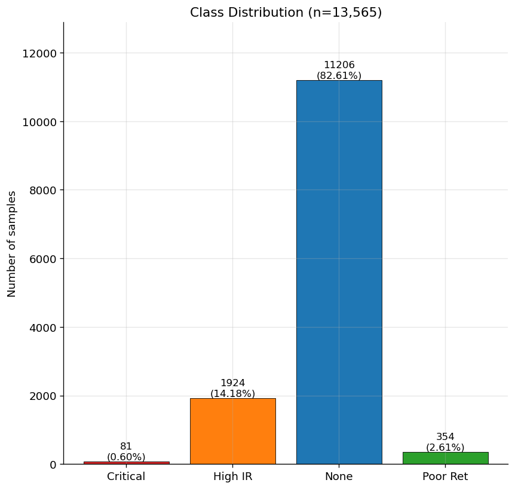
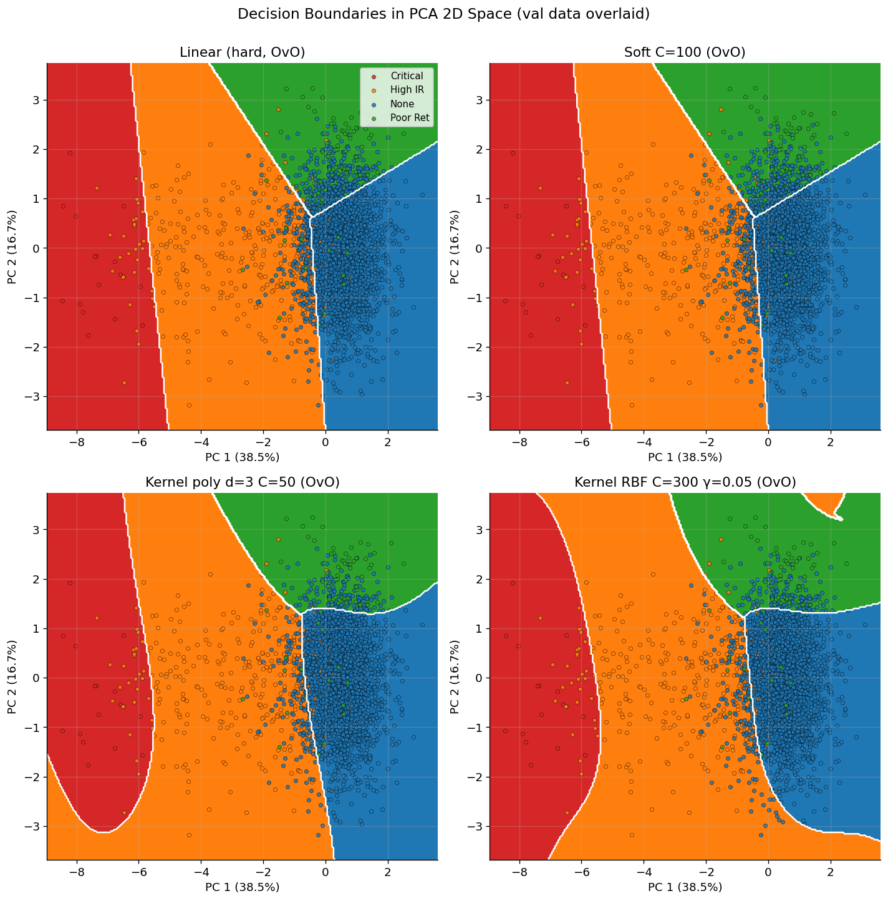
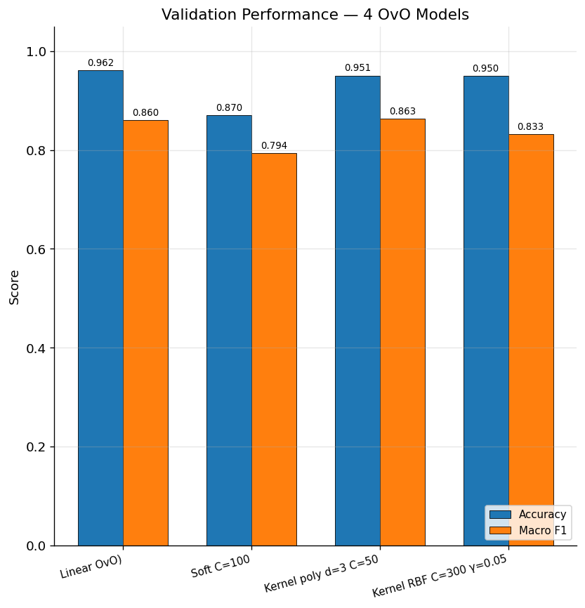
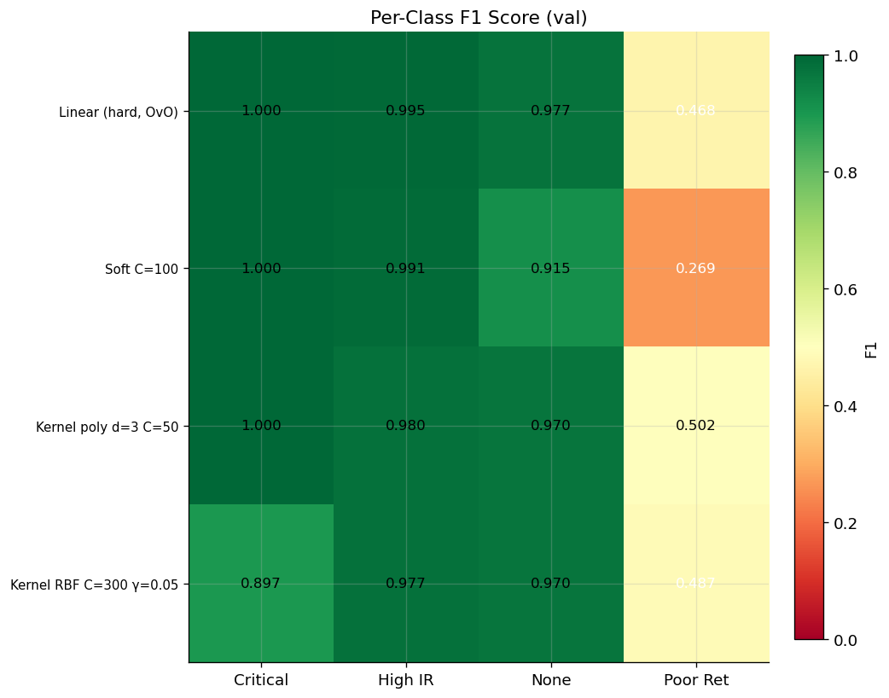
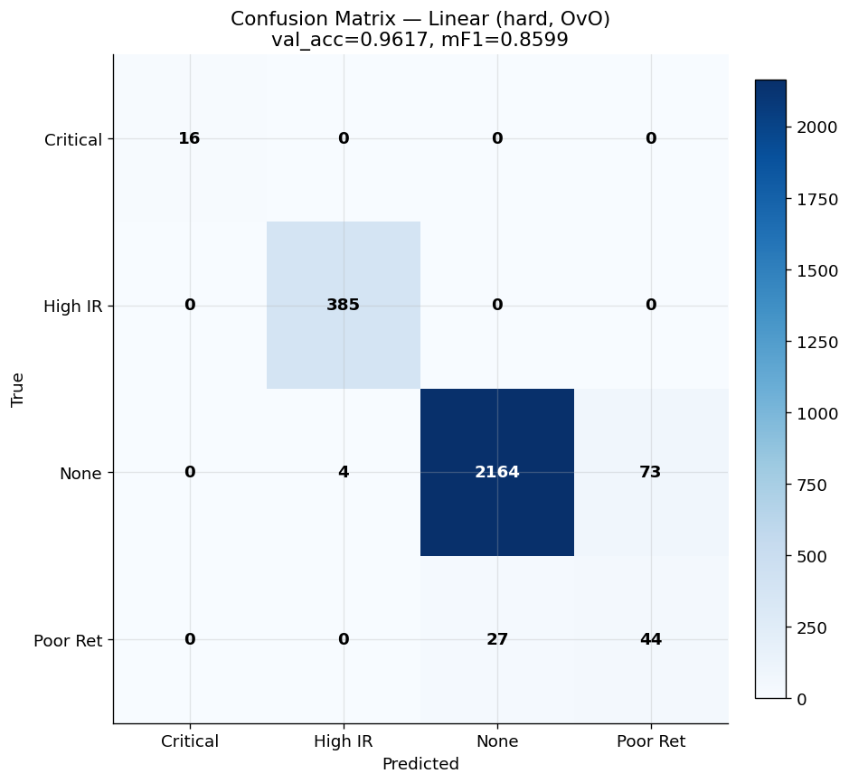

# STAI 중간 프로젝트 최종 보고서

**EV 배터리 결함 분류 — SVM 자체 구현** · 김재경 (jkkim-irim) · 2026-04-29
GitHub: <https://github.com/jkkim-irim/STAI>

---

## 1. 문제 & 데이터

EV 배터리 셀의 **6 가지 측정값** 으로부터 **결함 유형 4 가지** 분류.

| 클래스 | 의미 |
| --- | --- |
| **None** | 정상 (결함 없음) |
| **High IR** | High Internal Resistance — 내부 저항 높음 |
| **Poor Ret** | Poor Retention — 50 사이클 후 용량 유지율 저하 |
| **Critical** | Critical Resistance — 심각한 저항 결함, 폐기 |

피처 6 개: `Ambient_Temp_C`, `Anode_Overhang_mm`, `Electrolyte_Volume_ml`, `Internal_Resistance_mOhm`, `Capacity_mAh`, `Retention_50Cycle_Pct`.



> **그림 1.** 13,565 셀의 클래스 분포. **극심한 불균형** — None 82.6% / Critical 0.6%. 단순 정확도 만으로 평가하면 "전부 None 찍기" 도 82% 가 나오므로, **macro F1 score (mF1, 클래스 동등 가중)** 도 함께 평가.

---

## 2. 구현한 알고리즘 (룰 1 충족)

| 변형 | 한국어 | 코드 |
| --- | --- | --- |
| Linear hard-margin | 선형 SVM | `LinearHardMarginSVM` |
| Soft margin | 선형 분리불가능 SVM | `SoftMarginSVM` |
| Kernel (RBF, poly) | 비선형 SVM | `KernelSVM` |

**다중 클래스 전략 두 가지**:
- **OvR** (One-vs-Rest, 강의 11.4.3 의 1대c-1) — c 개 binary 분류기
- **OvO** (One-vs-One, 1대1) — c(c-1)/2 = 6 개 binary 분류기

**최적화**: `cvxopt.solvers.qp` (일반 QP solver, 룰 4 허용 — sklearn/libsvm 미사용).

→ **4 변형 × 2 전략 = 8 모델** 학습.

---

## 3. 알고리즘별 결정경계 (직관적 비교)



> **그림 2.** PCA 2D 공간에서 4 OvO 모델의 결정 경계 (시각화 목적의 mini-SVM, 실제 학습은 6D).
> - **Linear**: 직선 결합으로 영역 분할
> - **Soft**: 직선이지만 마진 위반 허용 → 부드러움
> - **Kernel poly**: 곡선 (3 차 다항식) 결정경계
> - **Kernel RBF**: 종 모양 / 원형 결정경계
>
> **알고리즘별 표현력 차이가 시각적으로 명확**.

---

## 4. 결과 — 단순 모델이 최고



> **그림 3.** 4 OvO 모델의 val 정확도 (파랑) + macro F1 (주황).

| 모델 | val_acc | val_mF1 |
| --- | --- | --- |
| **Linear hard + OvO** | **0.9617** | 0.860 |
| Kernel poly d=3 C=50 + OvO | 0.9506 | **0.863** |
| Kernel RBF C=300 γ=0.05 + OvO | 0.9495 | 0.833 |
| Soft C=100 + OvO | 0.8699 | 0.794 |

→ **가장 단순한 Linear hard-margin + OvO 가 정확도 1 위**. 비선형 커널은 이 데이터에 추가 가치 없음 (결정경계가 거의 선형).



> **그림 4.** 4 모델 × 4 클래스의 per-class F1 score 히트맵. 색깔 진할수록 잘 잡음. **Poor Retention** 이 모든 모델의 약점 (F1 0.31~0.55) — 6 피처로 None 과 분리 어려움.

---

## 5. 베스트 모델 confusion matrix



> **그림 5.** **Linear hard + OvO** 의 val 혼동행렬 (행=실제, 열=예측). Critical 16/16 (100%), High IR 385/385 (100%), None 2164/2241 (96.6%), Poor Ret 44/71 (62%).

---

## 6. 제출 모델 (룰 1 — 변형별 1 개씩)

| 룰 1 요구 | 모델 파일 | val_acc | val_mF1 |
| --- | --- | --- | --- |
| **선형 SVM** | `models/linear_hard_ovo.pkl` | **0.9617** | **0.860** |
| **선형 분리불가능 SVM** | `models/soft_C100_ovo.pkl` | 0.8699 | 0.794 |
| **비선형 SVM (poly)** | `models/kernel_poly_d3_C50_ovo.pkl` | 0.9506 | 0.863 |
| **비선형 SVM (RBF)** | `models/kernel_rbf_C300_g005_ovo.pkl` | 0.9495 | 0.833 |

### 사용법 — `predict.py` 한 줄

```bash
python predict.py --model models/linear_hard_ovo.pkl \
    --in 입력CSV.csv --out 예측결과.csv
```

입력 CSV 에 위 6 피처 컬럼만 정확히 있으면 동작. 출력 CSV 는 입력 + `Defect_Type_Pred` 열 추가.

---

## 7. 핵심 인사이트

1. **Occam's Razor 실증** — 단순한 선형 모델 + OvO 가 비선형 커널을 이김. 데이터의 결정경계가 거의 선형.
2. **OvO 가 OvR 을 macro-F1 에서 압도** (linear: 0.770 → 0.860). 1대1 binary 가 클래스 불균형을 자연스럽게 완화.
3. **Poor Retention 은 본질적 약점** — 모든 모델이 비슷하게 실수. 알고리즘 한계가 아닌 **6 피처의 한계** (None 과 분포 겹침).

---

## 부록 — 약어 / 위치

**약어**: SVM (Support Vector Machine), OvR/OvO (1대c-1 / 1대1), mF1 (macro F1), SV (Support Vector), CV (Cross-Validation), PCA (Principal Component Analysis), C / γ (gamma) / degree = 하이퍼파라미터.

**산출물**:
- 코드: [`src/svm.py`](../src/svm.py), [`train.py`](../train.py), [`predict.py`](../predict.py)
- 그림: [`figures/`](../figures/) (13 PNG, 4 카테고리)
- 단계별 기록: [`dvcc/00`](00_overview.md) ~ [`04`](04_results_2026-04-29.md)
- 강의자료 식 ↔ 코드 1:1 매핑: [`04_results.md`](04_results_2026-04-29.md) 부록 참조
